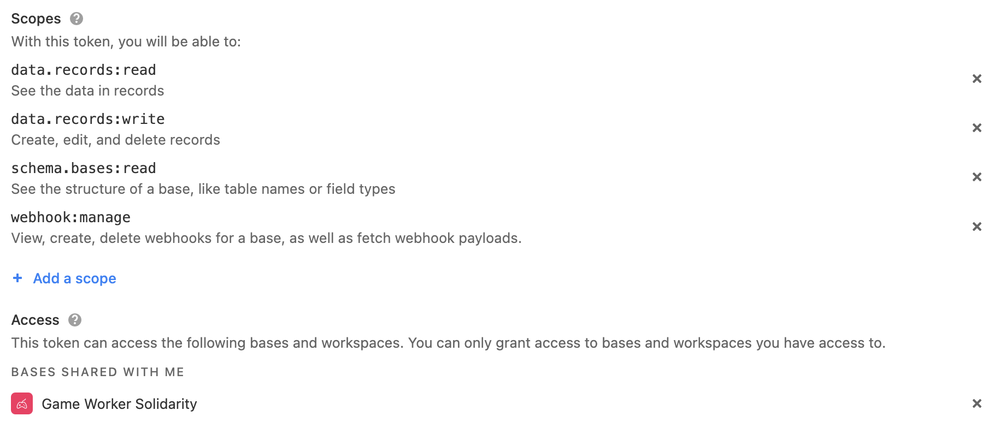

#  [Crimes of Solidarity](https://www.crimesofsolidarity.org/)

This is a new database website documenting crimes of solidarity and humanitarianism. This is a project led by [Dr. Lucy Mayblin](https://www.sheffield.ac.uk/socstudies/people/academic-staff/lucy-mayblin) at the University of Sheffield, UK.

Around the world, a growing number of people are subjected to criminal measures for helping irregular migrants, including those who are seeking asylum. Acts as simple as leaving water in the desert, saving someone from drowning in the sea, giving someone a lift to a medical facility, or a bed for the night, lead those offering such assistance open to arrest and imprisonment. While activists keep records of arrests in different countries, and there has been a lot of research in Europe on the criminalisation of solidarity activities, we currently have little understanding of this as a global phenomenon. The Crimes of Solidarity and Humanitarianism database aims to build understanding of criminalisation across borders for research and resistance.

Do you have any information to share with us that we can add to the archive? [Get in touch!](mailto:l.mayblin@sheffield.ac.uk)

# Technical documentation

Check out this [early stage, highly WIP documentation for the overall system.](https://www.notion.so/commonknowledge/System-Documentation-9986bf296f5341d0b0f0c1f66b67cd24) Later we will transpose that content to this README file.

## Getting started: run it on your machine

First, download the code from github (e.g. `git clone`).

You will need to copy `.env.template` to `.env.local` and fill out the required env variables.

- The Airtable private API key can be found [here, in your account settings.](https://airtable.com/account)

To run the system locally, on your machine you will need:

- `node` (recommend installing and managing this via [`nvm`](https://github.com/nvm-sh/nvm#installing-and-updating))
- ideally also [`yarn`](https://yarnpkg.com/getting-started/install), because we pin specific versions of package dependencies using yarn (see [`./yarn.lock`]('./yarn.lock'))

Install the required package dependencies:

```bash
yarn
# or
npm install
```

Then you can run the development server:

```bash
yarn dev
# or
npm run dev
```

Open [http://localhost:3000](http://localhost:3000) with your browser to see the result.

## Development guide

This is a [Next.js](https://nextjs.org/) project bootstrapped with [`create-next-app`](https://github.com/vercel/next.js/tree/canary/packages/create-next-app). To learn more about Next.js, take a look at the following resources:

- [Next.js Documentation](https://nextjs.org/docs) - learn about Next.js features and API.
- [Learn Next.js](https://nextjs.org/learn) - an interactive Next.js tutorial.

### Pages

You can start editing the page by modifying `pages/index.js`. The page auto-updates as you edit the file.
### API routes

[API routes](https://nextjs.org/docs/api-routes/introduction) can be accessed on [http://localhost:3000/api/hello](http://localhost:3000/api/hello). This endpoint can be edited in `pages/api/hello.js`.

The `pages/api` directory is mapped to `/api/*`. Files in this directory are treated as [API routes](https://nextjs.org/docs/api-routes/introduction) instead of React pages.

### Typescript interfaces and parsers

In development we've been generating schemas from typescript interfaces, to help smooth out API responses. When things aren't as expected, they don't show up.

To add to the schema, add interfaces to `types.ts`.

To regenerate the schema (at `schema.ts`):

```bash
yarn generateschema
```

## Deployment

This repository auto-deploys to Vercel.

## CDN for public file hosting

AWS S3 is used as a public CDN for Airtable images. Here's how it works:

- A hidden `cdn_urls` column exists on the Solidarity Actions table, which stores data about the publicly viewable URLs. This column should not be edited manually.
- The `cdn_urls` column is updated through the website's API — the `/api/syncToCDN` endpoint — which will upload Airtable's private attachments to the public CDN and then store the public URLs back in Airtable for serving in the frontend.
- Syncing is automated. Whenever an Airtable record is updated, a webhook trigger the re-sync. A [Github action](./.github/workflows/refreshWebhook.yml) regularly triggers a [maintenance script](./pages/api/createOrRefreshAirtableWebhook.ts) which establishes or refreshes the Airtable webhook which is responsible for syncing attachment updates.
- The webhook management script requires an Airtable access token in the env (`AIRTABLE_API_KEY`) configured [via this URL](https://airtable.com/create/tokens/new) as follows:
    
    - The `webhook:manage` in particular is required for webhook management
    - Three remaining permissions are required for syncing and other data fetching for the rest of the website:
      - `data.records:read`
      - `data.records:write`
      - `schema.bases:read`
